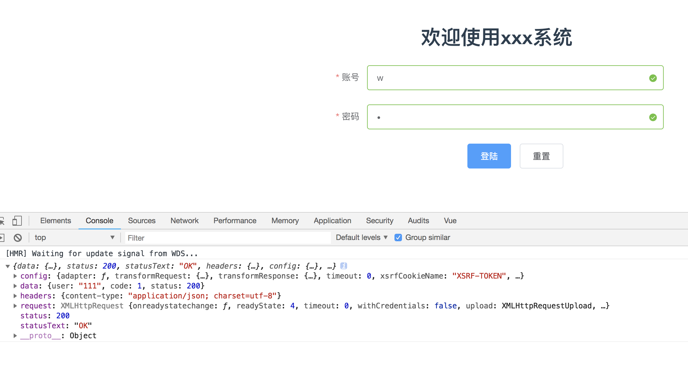
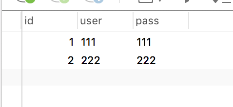

# koa2+vue
* 用vue-cli搭建前端项目
* 用koa2搭建后台，给前端提供数据访问接口

## 项目结构
 

* 用vue-cli 搭建的项目，红色框中是新建的文件夹用于存放koa
* 剩下的文件在写项目中慢慢增加，最初就是这样的
* 之后将项目跑起来，看一下有没有问题（这里就当作没有问题）

# 前端
* 这里选用Element-ui和vue搭配
* 这里采用的是element-UI的完整引入，如果小伙伴想用按需加载的话 参考[按需引入](http://element-cn.eleme.io/#/zh-CN/component/quickstart)
* 登陆页面就不介绍了 大家可以直接用（components/login.vue）

```
安装element-ui
    npm i element-ui -S
    
在src/main.js中引入
    import ElementUI from 'element-ui';
    import 'element-ui/lib/theme-chalk/index.css';
    Vue.use(ElementUI);
```

## 登陆
* 安装axios用于前后台的数据传输 `npm install --save axios`
* 在main.js中配置全局的axios
* 在src下新建一个axios文件夹，配置拦截器 和 全局地址 token 

```
import axios from 'axios' // axios引用
import qs from 'qs'

// axios.defaults.baseURL = 'http://localhost:3000'; // 全局的地址，因为我的koa监听端口是3000， 这里可以按照大家自己的来配置
// axios.defaults.headers.common['Authorization'] = AUTH_TOKEN;  //这是配置token
axios.defaults.headers.post['Content-Type'] = 'application/x-www-form-urlencoded';
// 添加请求拦截器
axios.interceptors.request.use(function (config) {
  // 在发送请求之前做些什么
  if(config.method === 'post'){
    config.data = qs.stringify(config.data)
  }
  return config;
}, function (error) {
  // 对请求错误做些什么
  return Promise.reject(error);
});

// 添加响应拦截器
axios.interceptors.response.use(function (response) {
  // 对响应数据做点什么
  return response;
}, function (error) {
  // 对响应错误做点什么
  return Promise.reject(error);
});

export default axios;
```

* 在src下新建一个api文件夹，存放访问后台的地址 

```
import axios from 'axios';
export default{
  denglu: (data) => {
    return axios.post('/login', data)
  }
}
```
> 前端先告一段落，我们来配置后台接口

## 搭建koa2
学习[koa](https://koa.bootcss.com/)
* 安装koa2 koa-bodyparser koa-router koa2-cors  `npm install --save koa koa-bodyparser koa-router koa2-cors`

-------
* [x] koa-bodyparser：用于接收并解析前台发送过来的post数据
* [x] koa-router：路由
* [x] koa2-cors：用来解决前端的跨域
* 搭建koa 在浏览器运行localhost:3000 页面输出 hello 表示成功了 😄

    _下面的代码是验证koa是否搭建成功，可以跳过_

```
const Koa = require('koa');
const bodyparser = require('koa-bodyparser');
    
const app = new Koa();
    
app.use(async (ctx) => {
  ctx.body = 'hello';
})
    
app.listen(3000);
```

* 接下来 开始搭建koa的路由

```
const Koa = require('koa'); 
const bodyparser = require('koa-bodyparser');
const router = require('koa-router')();
const login = require('./router/login.js');     //这是登陆路由的文件
const cors = require('koa2-cors');
const app = new Koa();
app.use(bodyparser())
这是处理前端跨域的配置
app.use(cors({
  origin: function (ctx) {
    if (ctx.url === '/login') {
      return "*"; // 允许来自所有域名请求
    }
    return 'http://localhost:8080';
  },
  exposeHeaders: ['WWW-Authenticate', 'Server-Authorization'],
  maxAge: 5,
  credentials: true,
  allowMethods: ['GET', 'POST', 'DELETE'],
  allowHeaders: ['Content-Type', 'Authorization', 'Accept'],
}));
    
router.use('/login',login);   //将路由提取出去便于管理
app
  .use(router.routes())
  .use(router.allowedMethods());
app.listen(3000);
```
* 接下来就是去配置登陆的路由

```
const router = require('koa-router')();

router
  .post('/', async ctx => {
    ctx.body = {  //这是向前台返回的数据 因为没有连接数据库所以我们自己定义，后面讲连接数据库
      user:'111',
      code:1,
      status:200
    };
  });

module.exports = router.routes();
```
* 接下来 进入src/axios下的文件打开 将注释的代码放开

``` 
axios.defaults.baseURL = 'http://localhost:3000'; // 全局的地址，因为我的koa监听端口是3000， 这里可以按照大家自己的来配置
```

### ok 我们开测试一下
可以用postmain 也可以直接在浏览器中测试
> postmain
>>


> chrome浏览器 直接在浏览器中测试
>>  

-------
能取到数据 那就说明没有问题
接下来开始连接数据库 数据库用的是 ***mysql***
## 创建数据库
* 我在本地用的是mamp+navicat 大家可以用自己熟悉的 
* 安装[mysql-pro](https://www.npmjs.com/package/mysql-pro) 一个连接数据库的中间件`npm install mysql-pro`
* 接下来在创建表
* 需要的字段

    | id | user | pass |
    | --- | --- | --- |

    
* 随便添加两个就可以了，这里没有做验证，需要的小伙伴可以自己添加这个功能
* 到此就结束了，我们来验证一下
* 在koa2/sql下新建一个js文件

    ```
    const Client = require('mysql-pro');
    const db = new Client({
      mysql:{
        host:'localhost',
        port:3306,
        database:'vue-koa2',
        user:'root',
        password:'root'
      }
    })
    
    module.exports = db;
    ```
    
* 接下来进入koa2/router下的login.js
* 看一下我们在前端拿到的数据

 
 因为我们用了中间件[koa-bodyparser](https://www.npmjs.com/package/koa-bodyparser) ,在koa2/router/login.js中这样写
 
     ```
     const router = require('koa-router')();
    const db = require('../sql/sql');
    
    router
      .post('/', async ctx => {
        let user = ctx.request.body   //接收前端传过来的post数据
        console.log(user);
        ctx.body = {
          user:'111',
          code:1,
          status:200
        };
      });
    
    module.exports = router.routes();
     ```
     控制台输出 { user: '123', pass: '123' }
     
接下来连接数据数据库,查询

```
const router = require('koa-router')();
const db = require('../sql/sql');

router
  .post('/', async ctx => {
    let user = ctx.request.body.user;
    let pass = ctx.request.body.pass;
    // 将接收到的前台数据和数据库中的数据匹配
    // 如果匹配成功 返回status 200 code 1
    // 不成功返回status 1000 code 0
    db.query('select * from login where user=? and pass=?;',[user,pass]).then(res => {
      console.log(res);
    })
    ctx.body = {
      user:'111',
      code:1,
      status:200
    };
  });

module.exports = router.routes();
```
控制台输出`[ RowDataPacket { id: 1, user: '111', pass: '111' } ]`
表示拿到数据
**注意**
    这是个数组的格式，如果将user返回给前端`res[0].user`,
    
```
const router = require('koa-router')();
const db = require('../sql/sql');

router
  .post('/', async ctx => {
    let user = ctx.request.body.user;
    let pass = ctx.request.body.pass;
    // 将接收到的前台数据和数据库中的数据匹配
    // 如果匹配成功 返回status 200 code 1
    // 不成功返回status 1000 code 0
    await db.query('select * from login where user=? and pass=?;', [user, pass]).then(res => {
      if (res.length === 0) {   // 数据库中没有匹配到用户
        ctx.body = {
          code: 0,
          status: 1000,
          msg: 'error'
        }
      } else {  //匹配到用户
        ctx.body = {
          user: res[0].user,
          code: 1,
          status: 200
        }
      }
    })

  });

module.exports = router.routes();
```

-------
以上就是简单的前后数据交互
接下来讲解的是vuex权限验证和token

-------
# token
* 创建token我们要用到
* [x] [验证token的网站](https://jwt.io/)
* [x] [创建token中间件](https://www.npmjs.com/package/jsonwebtoken)
    
* 在koa2中新建文件夹token
* token下新建一个addtoken.js用于创建token再新建一个proving.js用于验证token

> addtoken
```
const jwt = require('jsonwebtoken');
const serect = 'token';  //密钥，不能丢
module.exports = (userinfo) => { //创建token并导出
  const token = jwt.sign({
    user: userinfo.user,
    id: userinfo.id
  }, serect, {expiresIn: '1h'});
  return token;
};
```
在router/login中引入

    const router = require('koa-router')();
        const db = require('../sql/sql');
        const addtoken = require('../token/addtoken');
        
        router
          .post('/', async ctx => {
            let user = ctx.request.body.user;
            let pass = ctx.request.body.pass;
            // 将接收到的前台数据和数据库中的数据匹配
            // 如果匹配成功 返回status 200 code 1
            // 不成功返回status 1000 code 0
            await db.query('select * from login where user=? and pass=?;', [user, pass]).then(res => {
              if (res.length === 0) {   // 数据库中没有匹配到用户
                ctx.body = {
                  code: 0,
                  status: 1000,
                  msg: 'error'
                }
              } else {  //匹配到用户
                let tk = addtoken({user:res[0].user,id:res[0].id})  //token中要携带的信息，自己定义
                ctx.body = {
                  tk,  //返回给前端
                  user: res[0].user,
                  code: 1,
                  status: 200
                }
              }
            })
        
          });
        module.exports = router.routes();

# [vuex](https://vuex.vuejs.org/zh/)
拿到了后台的token，我们要做什么呢？
1. 存到localStorage中
    * 在src/components/login.vue中将token和user存进localStorage中
2. 存到vuex中
    * npm install --save vuex

这看自己的需求了
回到前端 我们改一下路由
> 没改之前

    import Vue from 'vue'
    import Router from 'vue-router'
    
    Vue.use(Router)
    
    export default new Router({
      routes: [
        {
          path: '/',
          name: 'login',
          component: resolve => require(['@/components/login'],resolve)
        },
        {
          path: '/homes',
          name: 'homes',
          component: resolve => require(['@/components/homes'],resolve)
        }
      ]
    })
>改过之后

    import Vue from 'vue'
    import Router from 'vue-router'
    
    Vue.use(Router);
    
    const router = new Router({
      routes: [
        {
          path: '/',
          name: 'login',
          component: resolve => require(['@/components/login'], resolve)
        },
        {
          path: '/homes',
          name: 'homes',
          meta: {
            auth: true
          },
          component: resolve => require(['@/components/homes'], resolve)
        }
      ]
    });
    
    router.beforeEach((to, from, next) => {
      if (to.meta.auth) { //权限判断
        if ('进行判断') { //读取token值
        //  成功
          next()
        } else {
          next({path:'/'})
        }
      } else {
        // 没有meta.auth 不用管
        next()
      }
    });
    
    export default router;
    
在路由中要验证的地方添加meta：{auth：true}

接下来就是创建vuex
1. 在src下新建文件夹vuex
2. 全局引入vuex
3. 在vuex中新建store.js文件

        import Vue from 'vue';
        import Vuex from 'vuex'
        Vue.use(Vuex);
        
        const store = new Vuex.Store({
          state:{
            user:localStorage.getItem('user') || '',
            token:localStorage.getItem('token') || null
          }
        });
        export default store;

1. 接下来改一下路由中的权限判断 

        router.beforeEach((to, from, next) => {
          if (to.meta.auth) { //权限判断
            if (localStorage.getItem('token')) { //读取token值
            //  成功
              next()
            } else {
              next({path:'/'})
            }
          } else {
            // 没有meta.auth 不用管
            next()
          }
        });
在login.vue中接收到数据后添加

        localStorage.setItem('token', data.data.tk) //存储token
        localStorage.setItem('user', data.data.user) //存储用户
        this.LOGIN({
          token:data.data.tk,
          user:data.data.user
        });
        
5. 这样就将token拿到了并存进localStorage中，接下来就是将token在发送的时候 添加进头部中 发送给后台
6. 在axios/axios.js中

         axios.defaults.headers.common['Authorization'] = 'Bearer '+ localStorage.getItem('token');
         
7. 在登陆的时候这样就会将token发送给后台了
8. 后台验证前台发送的token 

        const jwt = require('jsonwebtoken');
        const serect = 'token';  //密钥，不能丢
        module.exports =(tokens) => {
        
          if (tokens){
            let toke = tokens.split(' ')[1];
            // 解析
            let decoded = jwt.decode(toke, serect);
            return decoded;
          }
        };

9. 在login.js中，添加

           router.get('/test',async (ctx,next) => {
        let token = ctx.request.header.authorization;
        if (token){
        //  获取到token
          let res = proving(token);
            if (res && res.exp <= new Date()/1000){
              ctx.body = {
                message: 'token过期',
                code:3
              };
            } else {
              ctx.body = {
                message: '解析成功',
                code:1
              }
            }
        } else{  // 没有取到token
          ctx.body = {
            msg:'没有token',
            code:0
          }
        }
        });
        
-------
项目至此算是告一段落，大家可以把我的项目clone到本地下运行
[项目地址](https://github.com/seven0717/koa2-vue)

* 运行方式
  * 运行vue npm start
  * 在koa2下运行app.js node app.js
## 项目中也许有很多写的不对的地方，或者不规范什么的 大家就引以为戒，
#### 项目有时间会更新，都是些小东西，大家可以看一下，大牛绕路哦 😄
